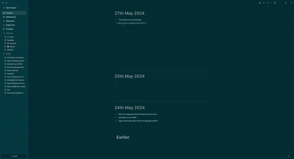

# Logseq-LogArxivMate


Logseq-LogArxivMate is a powerful plugin for Logseq that allows you to extract and organize information from an arXiv link. With a simple command, you can fetch paper details and create a dedicated page with this information. The plugin also provides customization options for the page template to fit your needs.

## Features

- Extract paper information from arXiv links.
- Create a new page in Logseq with the extracted information.
- Customizable page template through plugin settings.





## Usage

### Fetching Paper Information

To extract information from an arXiv link and create a new page:

1. Copy the arXiv link of the paper you are interested in.
2. Open your Logseq workspace.
3. Paste the arXiv link in the block you want to create the page.
4. Type the command `/get arxiv paper`.

The plugin will fetch the paper details and create a new page with the following information:

- Paper title
- Authors
- Abstract
- arXiv ID
- Link to the paper

### Customizing the Page Template

You can customize the template used for creating new pages with paper information. To do this:

1. Go to **Settings** > **Logseq-LogArxivMate**.
2. Modify the template to suit your needs. You can use placeholders such as `{{paperId}}`, `{{title}}`, `{{summary}}`, `{{authors}}`, `{{absUrl}}` and `{{today}}` to dynamically insert paper details.

## Example

### Command

```
https://arxiv.org/abs/1234.5678 /get arxiv paper
```

### Default Page Template

```markdown
# {{title}}

**Authors:**  {{#each authors}}[[{{this}}]]{{#unless @last}}, {{/unless}}{{/each}}

**Abstract:**
{{summary}}

**arXiv ID:** {{paperId}}

**Link to Paper:** [arXiv](https://arxiv.org/abs/{{paperId}})
```

### Resulting Page

```markdown
# Sample Paper Title

**Authors:** [[John Doe]], [[Jane Smith]]

**Abstract:**
This is a sample abstract of the paper. It provides a brief summary of the research and findings.

**arXiv ID:** 1234.5678

**Link to Paper:** [arXiv](https://arxiv.org/abs/1234.5678)
```

## Support

For issues, suggestions, or contributions, please visit the [GitHub repository](https://github.com/ssamdav/logseq-logarxivmate) and open an issue or pull request.

## License

This project is licensed under the MIT License. See the [LICENSE](LICENSE) file for details.